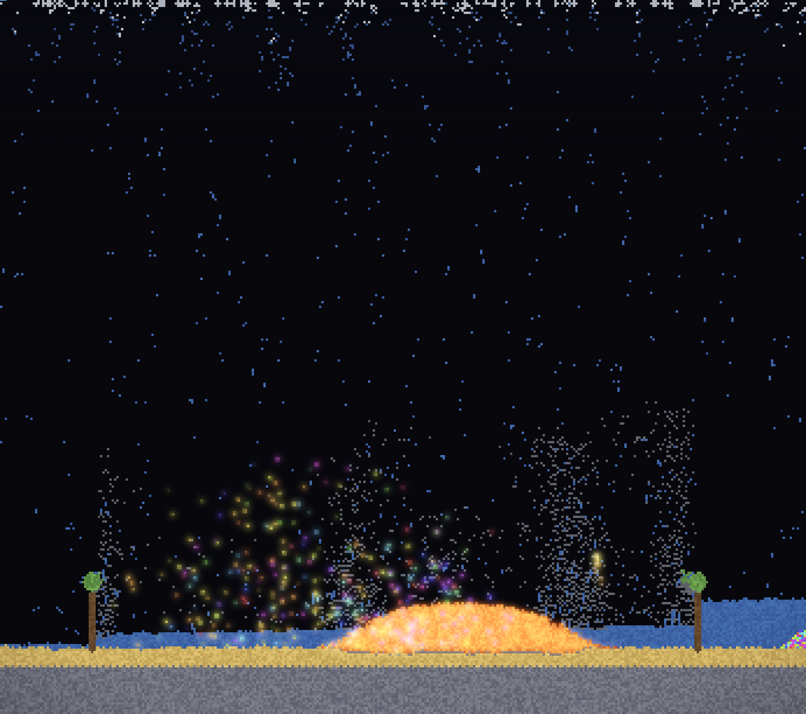
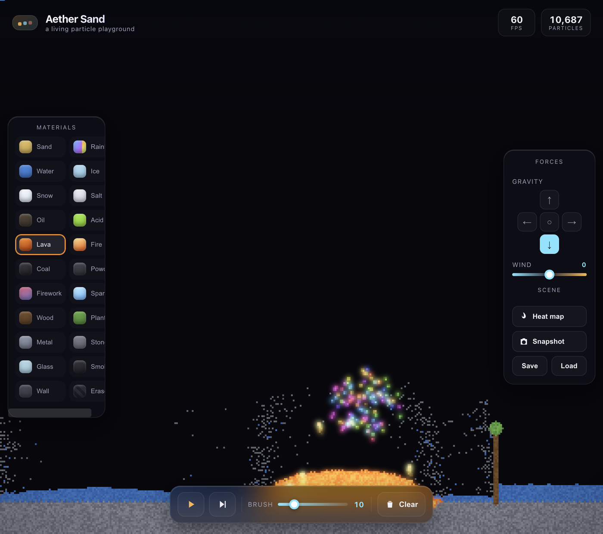
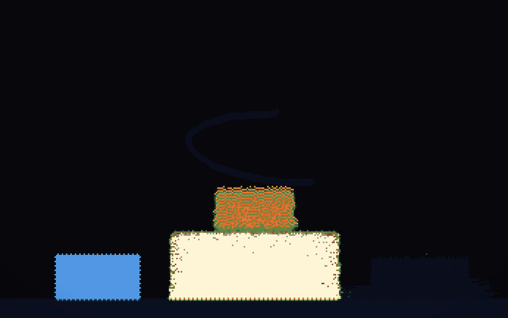

# 🏜️ Aether Sand

<p align="center">
  <a href="https://isco-tec.github.io/aether-sand/">
    
  </a>
</p>

<p align="center">
  <a href="https://isco-tec.github.io/aether-sand/"><b>▶&nbsp; Play the live demo</b></a>
</p>

A from-scratch, physics-rich **falling-sand simulator** built in pure vanilla JavaScript — no libraries, no build step. A cellular-automata engine with density-based fluid dynamics, a real **heat/temperature field**, emergent material reactions, emissive bloom rendering, and a ballistic particle layer for fireworks and explosions.

> Three files (`index.html` / `style.css` / `script.js`) that drop straight into CodePen's HTML / CSS / JS panels.

## ✨ Features

- **Cellular-automata core** on typed-array grids with density-based displacement (sand sinks through water, water floats on oil, gases rise) and bias-free alternating scan order.
- **Real thermodynamics** — a per-cell temperature field with heat diffusion drives emergent phase changes (water ⇄ ice ⇄ steam, sand → glass, stone ⇄ lava, metal melting, ignition).
- **Blackbody incandescence** — anything hot enough glows on its own, so heated metal and stone smoulder red → orange → yellow → white as the temperature climbs.
- **24+ materials & tools** with distinct behaviour: sand, rainbow sand, water, ice, snow, salt, oil, acid, lava, fire, coal, gunpowder, fireworks, electric spark, wood, plant, metal, stone, glass, smoke, wall — plus a **Cloner** that duplicates whatever it touches and a **Void** that devours it.
- **Heat & Freeze brushes** — paint temperature straight onto the world with a torch and a cryo tool to ignite, melt, or flash-freeze on demand.
- **Ballistic particle system** for fireworks, explosions and embers — buttery floating-point motion layered on top of the grid.
- **Gravity & wind controls** — point gravity in any direction (or zero-G) and blow particles around with adjustable wind.
- **Dynamic lighting** — every emitter (fire, lava, red-hot metal, sparks, fireworks) projects coloured light onto the matter around it, so a stone wall beside a lava pool actually warms to orange. Layered on top of the emissive bloom for true depth.
- **Snapshot & save/load** — export a PNG of your creation or save/restore scenes.
- **World-class UI** — glassmorphism panels, live FPS + particle counters, an optional heat-map overlay, full keyboard shortcuts, mouse + touch support, and responsive resize that preserves your artwork.

## 🖼️ Gallery

| World-class interface | Live heat-map overlay |
| --- | --- |
|  |  |

## 🎮 Controls

| Action | Control |
| --- | --- |
| Draw | Click + drag |
| Erase | Right-click / Shift + drag |
| Pause / play | `Space` |
| Step one frame | `→` |
| Clear | `C` |
| Heat-map overlay | `H` |
| Toggle dynamic lighting | `L` |
| Brush size | `[` / `]` or the slider |
| Pick material | `1`–`9` or the palette |

## 🚀 Run it

Play it instantly at **[isco-tec.github.io/aether-sand](https://isco-tec.github.io/aether-sand/)**.

It's also fully static — just open `index.html`, or serve the folder:

```bash
python3 -m http.server 8000
# then visit http://localhost:8000
```

Or paste each file into the matching panel on [CodePen](https://codepen.io).

## 🧰 Scripting API

The simulator exposes a small `window.AetherSand` API so you can script, automate, or embed it (all coordinates are in grid cells):

```js
const A = window.AetherSand;
A.setMaterial("lava");        // by name (or A.LAVA)
A.paint(x, y, "water", 6);    // paint a disc (material + brush optional)
A.paint(x, y, "heat", 8);     // torch (or "freeze") to paint temperature
A.line(x0, y0, x1, y1, "metal", 2);
A.paint(x, y, "cloner");      // duplicates whatever it touches ("void" devours)
A.firework(x, y);             // launch a firework rocket
A.gravity(0, -1);             // flip gravity up (8-way + 0,0 for zero-G)
A.wind(0.8);                  // -1..1
A.heatMap(true);              // toggle the temperature overlay
A.lights(false);              // toggle dynamic lighting on/off
A.clear(); A.save(); A.load(); A.snapshot();
A.info();                     // { cells, particles, gravity, wind, ... }
```

## 🧪 How it works

The world is a grid of cells; each frame every cell runs simple local rules (fall, flow, rise, react). Complex, lifelike behaviour **emerges** from these rules plus the shared temperature field. The renderer writes the grid into an `ImageData` buffer scaled up with crisp pixels, while emissive materials also paint into a separate glow canvas that is blurred and screen-blended for bloom. Those same emitters are splatted into a low-res light buffer that is blurred and added back onto nearby matter, giving real coloured illumination on top of the bloom. A lightweight particle layer adds true ballistic motion for sparks and fireworks.

## 📄 License

[MIT](./LICENSE)
