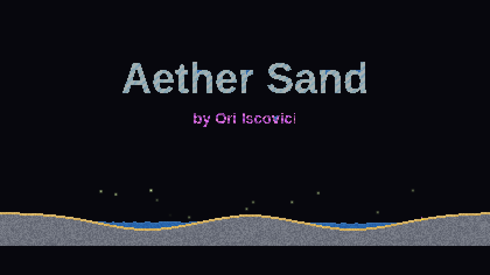
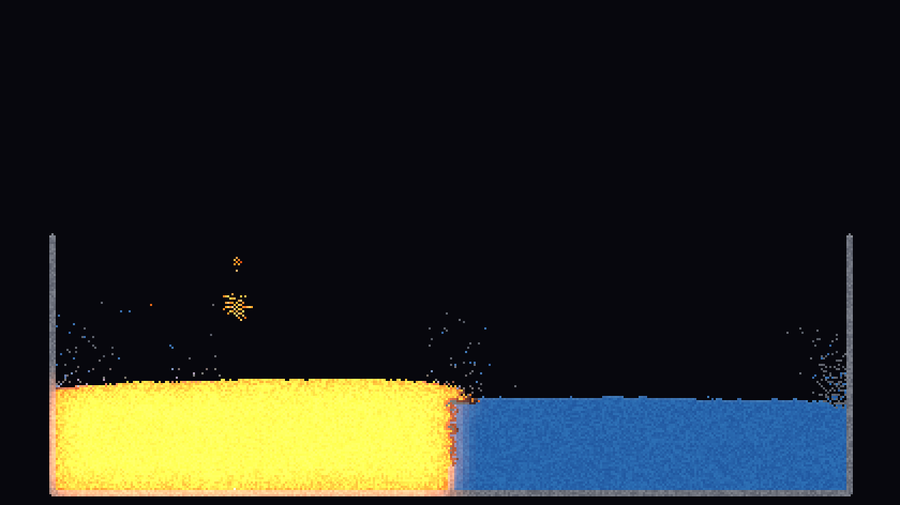
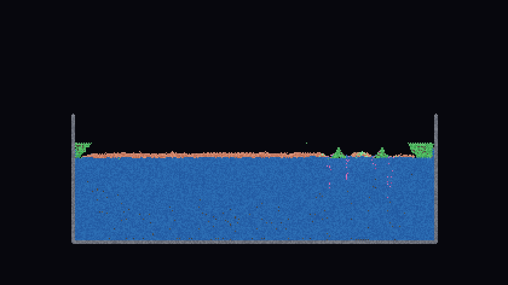
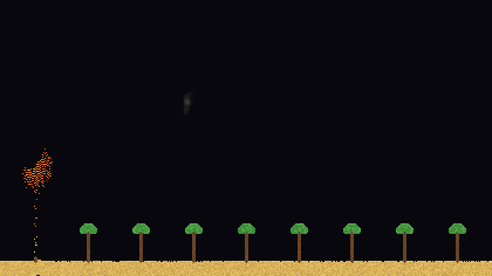

# 🏜️ Aether Sand

<p align="center">
  <a href="https://isco-tec.github.io/aether-sand/">
    
  </a>
</p>

<p align="center">
  <b>A living particle playground where sand, fire, storms, metal, life and alchemy obey a handful of simple rules — and surprise you anyway.</b>
</p>

<p align="center">
  <a href="https://isco-tec.github.io/aether-sand/"><b>▶&nbsp; Play the live demo</b></a>
  &nbsp;·&nbsp;
  <a href="https://labs.iscovici.com">Made in Iscovici Labs</a>
</p>

Aether Sand is a physics-rich **falling-sand simulator** written from scratch in pure vanilla JavaScript. No libraries. No framework. No build step. Underneath the glow is a cellular-automata engine with density-based fluid dynamics, a real per-cell **temperature field**, a **pressure** system, **electricity**, a **nuclear** chain reaction, deep emergent chemistry — and a whole **living aquatic ecosystem**. Drop a pixel of sand and watch a world react: smelt ore in a furnace, breed a thunderstorm, grow a forest, run a reactor, or chase the Magnum Opus.

> Three files — `index.html` / `style.css` / `script.js` — that paste straight into CodePen's HTML / CSS / JS panels (there's a ready-to-paste **`codepen-html.txt`** in this repo), or deploy as a static site (it ships on GitHub Pages).

## ✨ Features

### The engine
- **Cellular-automata core.** Typed-array grids with density-based displacement — sand sinks through water, water floats on oil, gases rise and *bubble up through liquids* — plus a bias-free alternating scan order so nothing drifts sideways. An **active-region tracker** bounds both simulation and rendering to just the part of the world that's actually doing something, so a sprawling, mostly-quiet world stays smooth.
- **Real thermodynamics.** A per-cell heat field with diffusion drives phase changes that *emerge* rather than being scripted: water ⇄ ice ⇄ steam ⇄ cloud ⇄ rain, sand → glass, stone ⇄ lava, the metal foundry, spontaneous ignition. **Blackbody incandescence** makes anything hot enough self-glow — metal and stone smoulder red → orange → yellow → white as the temperature climbs.
- **Combustion that needs air.** Fire burns hotter in **oxygen** (breathing it out as **carbon dioxide**), suffocates when sealed, is snuffed by CO₂ (a heavy gas that sinks and smothers), and races cell-to-cell as **wildfire** through any connected fuel.
- **Pressure & shockwaves.** Gases build real pressure and jet through gaps; explosions emit a shockwave that physically shoves matter outward and can shatter glass back into sand. Toggle the pressure-map overlay with `P`.
- **Electricity.** Charge is a *physical phenomenon*, not a circuit kit: a **spark** energizes any conductor (metal, gold, water, brine, mercury) and the current races through it; **lightning** scorches and electrifies; **bulbs** glow when charge reaches them; charge drives **electrolysis**, splitting water into hydrogen + oxygen and brine into hydrogen + chlorine.
- **Weather & the water cycle.** Paint **storm clouds** that drift on the wind, gather a finite reserve of rain, and hurl **lightning** whose frequency emerges from the storm's size; pollute a cloud with smoke and it sours into an **acid-rain cloud**. Lightning sizzles water rather than boiling it away — a real water cycle, not a runaway.

### Worlds within the world
- **🔥 The foundry & metallurgy.** Eight metals — iron, copper, tin, **bronze**, **steel**, silver, gold, aluminium — each melt at scientifically re-scaled points into a shared **molten metal** that remembers its source and **casts back** to the exact solid (flash-casting in water). Alloy copper + tin into bronze, carburize iron + coal into steel, watch copper green to **patina**, silver darken to **tarnish**, tin crumble to **tin pest** in the cold. Acid tells noble from base: gold, silver and copper resist plain acid and yield only to **aqua regia**.
- **⛏️ Geology & the rock cycle.** Smelt **iron ore, malachite and cassiterite** against burning coal (carbothermic reduction — heat alone won't free the metal). Bury sand until it cements to **sandstone**; cook rock under heat + pressure into **slate, marble and quartzite**; weather it all back to sand. Grow **crystals**, forge **diamond** from coal, fuse **fulgurite** where lightning strikes sand.
- **☢️ Nuclear.** Seed a neutron into a **uranium** pile and start a self-sustaining **fission chain** — every fission splits one fuel cell, dumps heat, and emits prompt neutrons; **plutonium** is twitchier, **control rods** drink the neutrons to scram it, water moderates them, and the fuel breeds Pu under flux. A fierce enough burst throws up a physically-modelled **mushroom cloud** (a real edge-on vortex ring). Spent fuel decays through **fallout** to ash.
- **🌟 Fusion & plasma.** Crush **hydrogen** in a fission blast to fuse it into **helium**; tear any gas into glowing violet **plasma** with extreme heat or a lightning bolt — which cools back into the very gas it came from.
- **⚗️ Reactive chemistry.** Drop **sodium** in water for an alkali eruption, burn **magnesium** in a flare you can't drown, combine sodium + **chlorine** into table salt, run the chlor-alkali process, spark hydrogen + chlorine into acid.
- **🌱 A living world.** Sow **seeds** on damp soil — but not in brine, and salt withers what grows. They germinate into **saplings** that climb a trunk toward the light and burst into a leafy **crown**; **plants** photosynthesise (CO₂ → O₂) and reach for the light; **vines** climb; **mold** spreads and rots; **wildfire** sweeps through forests, and the **ash** it leaves enriches the soil so the next seeds sprout faster — a whole forest cycle.
- **🦠 A living aquatic ecosystem.** A genuinely emergent, provably-bounded food web: **algae** drinks water + light, **krill** graze it, **ciliates** hunt the krill, **carrion** sinks and **bacillus** recycles it to nutrient — populations boom, bust and recover. Irradiate the water and plankton mutate into glowing strains; starve them and they bank into dormant **resting cysts** and **spores** that wait out the famine. A whole pond you tend.

### Alchemy & spectacle
- **Real, reversible chemistry & alchemy.** Salt dissolves into **brine** and crystallises back when the brine boils dry; mercury + sulfur marry into **cinnabar** and roast back apart; **limestone** calcines to **quicklime**, slakes violently into a base, then **carbonates** back to limestone — a closed lime cycle. Lava + water → obsidian; acid + mercury → gold; **aqua regia** dissolves gold to mercury; smoke + sulfur → acid; sulfur + saltpeter + coal → gunpowder; with **thermite**, **fuse**, **nitro** and matter-annihilating **antimatter** for the pyrotechnics.
- **The Magnum Opus.** The Philosopher's Stone can be *earned*. Put the **tria prima** (mercury + sulfur + salt) to the fire and the Great Work begins: matter blackens (**nigredo**), washes white (**albedo**), ripens gold (**citrinitas**), and — perfected with gold — reddens into the **Stone** (**rubedo**). Lay it against base matter and it **projects**, perfecting stone, rust and coal into gold.
- **A cinematic first run.** The world introduces itself: the title materialises in glowing diamond, a stream of sand pours across it, it dissolves into water that fills the basins, gold dust rains, trees spring up around the oasis, and dawn breaks over the lakes — then rests, inviting you to *get in your element*.
- **Dynamic lighting, ballistic particles & screen-shake.** Every emitter — fire, lava, red-hot metal, plasma, sparks, fireworks, bulbs — casts coloured light onto nearby matter, layered over emissive bloom. A floating-point particle layer drives fireworks, embers and explosions, and a big blast punches the whole screen (with a `prefers-reduced-motion` opt-out).
- **Procedural sound.** A fully synthesized soundtrack — no audio files — built live with the Web Audio API: fire crackle, water trickle and lava rumble track the world while explosions thud, lightning cracks, and a chime rings on every new discovery.

### The package
- **100+ materials & tools** across six tabbed, searchable categories — **Earth · Metals · Liquids & Gas · Reactive · Alchemy · Tools** — with full-width readable buttons and a live description (plus a *whisper* teasing an undiscovered recipe) for whatever you've selected.
- **An Alchemy Book** of 130+ recipes that reveal themselves as you discover them through play — ingredient swatch-chips, a discovery progress bar, **NEW** badges, grouped by category, with a sandbox "reveal all" toggle.
- **51 Challenges** across six mastery tiers — *Apprentice → Adept → Alchemist → Grandmaster → Naturalist → Artificer* — from *light 5 bulbs at once* and *forge a diamond* to *trigger a fission chain*, *run a full food web* and *complete the Magnum Opus*; progress saves locally, a **Next** nudge always shows your goal, and a little confetti fires when you nail one.
- **Shareable links, share cards & saves.** Pack an entire scene into a (run-length-compressed) URL and send it — the world rebuilds itself the moment it opens. Or grab a one-tap branded **share card** PNG. Plus local save/restore.
- **Gravity & wind** in any of 8 directions plus zero-G, a **World** control (Cozy / Balanced / Grand), heat-map and pressure-map overlays, and full mouse + touch with responsive, artwork-preserving resize.
- **Accessibility.** Keyboard-operable controls with a visible focus ring, `aria-pressed` toggles, ARIA-labelled icon buttons, focus-trapped dialogs, an `aria-live` status region, a `prefers-reduced-motion` guard on the flash + shake, and notched-device safe-area support.

## 🖼️ Gallery

| Molten thermodynamics — lava meets water → obsidian + steam | A living aquatic food web — algae, krill & a glowing mutant |
| --- | --- |
|  |  |
| **Wildfire on the wind** — a forest catches, embers drift | **Spectacle at night** — lava, fireworks, snow & water |
|  |  |
| **The live temperature field** (heat-map overlay) | **The glassmorphism interface** |
|  |  |

## 🎮 Controls

| Action | Control |
| --- | --- |
| Draw | Click + drag |
| Erase | Right-click / `Shift` + drag |
| Pause / play | `Space` |
| Step one frame | `→` |
| Clear | `C` |
| Heat-map overlay | `H` |
| Pressure-map overlay | `P` |
| Toggle dynamic lighting | `L` |
| Mute / unmute sound | `M` |
| Open alchemy book | `B` |
| Challenges | `G` or the trophy |
| About panel | Click the title |
| Brush size | `[` / `]` or the slider |
| Pick material | `1`–`9` or the palette |

## 🚀 Run it

Play it instantly at **[isco-tec.github.io/aether-sand](https://isco-tec.github.io/aether-sand/)**.

It's fully static, so you can also just open `index.html` — or serve the folder:

```bash
python3 -m http.server 8000
# then visit http://localhost:8000
```

**On CodePen:** paste each file into its panel — `style.css` → **CSS**, `script.js` → **JS**, and the body markup → **HTML** (this repo ships **`codepen-html.txt`**, the body already stripped of the `<link>`/`<script>` tags so the panels don't double-load). No external libraries to add — it's pure vanilla JS.

## 🧰 Embed &amp; extend — the `AetherSand` API

Aether Sand exposes a small `window.AetherSand` API so you can script, automate, or embed it in your own project. Want it integrated into something you're building? Reach me at [labs.iscovici.com](https://labs.iscovici.com). All coordinates are in grid cells:

```js
const A = window.AetherSand;

A.setMaterial("lava");            // select by name (or A.LAVA)
A.paint(x, y, "water", 6);        // paint a disc (material + brush optional)
A.paint(x, y, "heat", 8);         // torch — paint temperature (or "freeze")
A.line(x0, y0, x1, y1, "metal", 2);

A.paint(x, y, "iron_ore", 5);     // smelt it against hot coal → molten iron → cast it
A.paint(x, y, "uranium", 6);      // seed a "neutron" beside it for a fission chain
A.paint(x, y, "algae", 4);        // a pond producer — feed "krill", then "ciliate"
A.paint(x, y, "mercury", 5);      // dense liquid metal that amalgamates
A.paint(x, y, "philosopher");     // catalyst — accelerates nearby transmutations
A.paint(x, y, "aqua", 4);         // aqua regia — dissolves gold/silver/copper
A.paint(x, y, "thermite", 4);     // ignite it to burn through metal
A.line(x0, y0, x1, y1, "fuse");   // slow-burning cord to a gunpowder cache
A.paint(x, y, "cloud", 5);        // storm cloud — drifts, rains, and strikes
A.paint(x, y, "antimatter");      // annihilates any matter it touches
A.paint(x, y, "cloner");          // duplicates whatever it touches ("void" devours)

A.firework(x, y);                 // launch a firework rocket
A.lightning(x, y);                // call down a lightning bolt
A.gravity(0, -1);                 // flip gravity up (8-way, plus 0,0 for zero-G)
A.wind(0.8);                      // -1..1

A.heatMap(true);                  // toggle the temperature overlay
A.lights(false);                  // toggle dynamic lighting
A.lightLevel(0.4);                // dim bloom + coloured light (0..1 or 0..100)

A.clear(); A.save(); A.load(); A.snapshot();
A.share();                        // copy a shareable link (whole scene packed into the URL)
A.info();                         // { cells, particles, gravity, wind, ... }
```

## 🧪 How it works

The world is a grid of cells. Each frame, every cell runs a few simple local rules — fall, flow, rise, react — and complex, lifelike behaviour **emerges** from those rules plus shared temperature and pressure fields. Nothing is choreographed; it's just neighbours talking to neighbours. The hard rule the whole project is built on: **every reaction is provably bounded** — no chain runs away, no cell spawns from nothing.

The renderer writes the grid into an `ImageData` buffer scaled up with crisp pixels. Emissive materials also paint into a separate glow canvas that's blurred and screen-blended for bloom, and those same emitters splat into a low-res light buffer that's blurred and added back onto nearby matter for true coloured illumination. A lightweight floating-point particle layer rides on top for sparks, embers and fireworks.

## 👤 About the author

Built by **Ori Iscovici**. More experiments live at **[labs.iscovici.com](https://labs.iscovici.com)** — and the source for this one is on [GitHub](https://github.com/isco-tec/aether-sand).

## 📄 License & credit

**The code is [MIT](./LICENSE)** — free to use, fork, learn from, and build on.

**The work as a whole** — the *Aether Sand* name, its visual design, and the project as a creative piece — is © 2026 Ori Iscovici and shared under [**CC BY 4.0**](https://creativecommons.org/licenses/by/4.0/). In plain terms: use it and remix it freely, just credit the author. This one line does the job:

> Aether Sand by **Ori Iscovici** — [labs.iscovici.com](https://labs.iscovici.com)

Want to use it commercially, or embed it in a product? I'd love to hear about it — reach me through [labs.iscovici.com](https://labs.iscovici.com).
